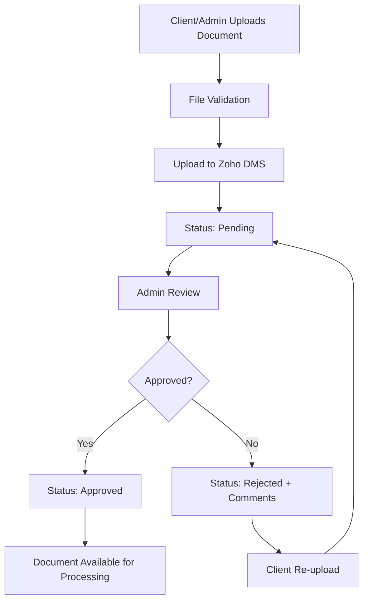
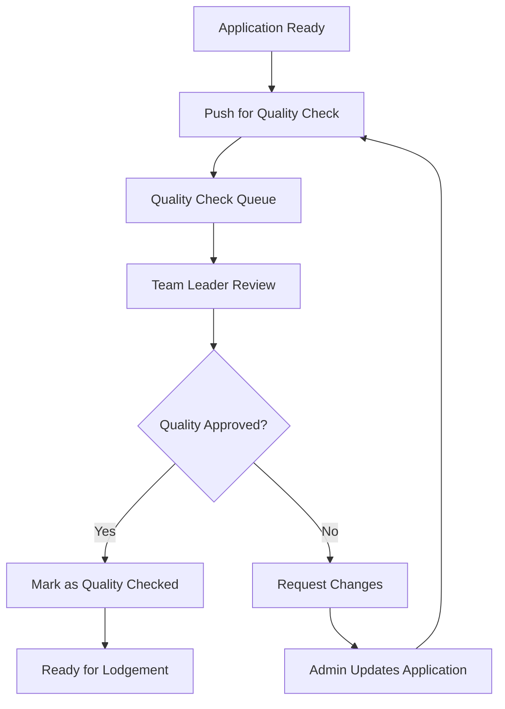
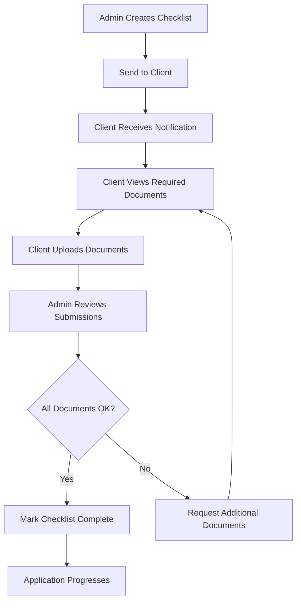

# WorldVisa DMS - Document Management System

A comprehensive Document Management System built for visa application processing, featuring real-time notifications, role-based access control, and advanced document workflow management.

## 🏗️ Architecture Overview

### Technology Stack
- **Framework**: Next.js 15 with App Router
- **Language**: TypeScript
- **Styling**: TailwindCSS v4
- **UI Components**: Shadcn UI + Radix UI
- **State Management**: 
  - Client State: Zustand
  - Server State: TanStack Query v5
- **Real-time**: Socket.IO Client
- **Caching**: Redis (Upstash)
- **Authentication**: JWT with role-based access
- **Error Tracking**: Sentry
- **Animations**: GSAP
- **Performance**: Custom performance monitoring hooks

### Core Features
- **Multi-role Authentication** (Admin, Client, Master Admin, Team Leader, Supervisor)
- **Document Upload & Management** with real-time status updates
- **Quality Check Workflow** for application review
- **Real-time Notifications** via WebSocket
- **Checklist Management** for document requirements
- **Requested Documents** workflow
- **Performance Monitoring** and optimization
- **Responsive Design** with modern UI/UX

## 📁 Project Structure

```
src/
├── app/                          # Next.js App Router
│   ├── (public)/                # Public routes (login, portal)
│   │   ├── admin-login/         # Admin authentication
│   │   ├── client-login/        # Client authentication
│   │   └── portal/              # Public portal
│   ├── admin/                   # Admin dashboard routes
│   │   ├── applications/        # Application management
│   │   ├── checklist-requests/  # Checklist management
│   │   ├── quality-check/       # Quality control
│   │   └── requested-docs/      # Document requests
│   ├── client/                  # Client dashboard routes
│   │   └── applications/        # Client application view
│   └── api/                     # API routes
│       ├── auth/                # Authentication endpoints
│       ├── realtime/            # WebSocket endpoints
│       └── zoho_dms/            # Zoho DMS integration
├── components/                   # React components
│   ├── applications/            # Application-related components
│   ├── auth/                    # Authentication components
│   ├── common/                  # Shared components
│   ├── notifications/           # Notification system
│   ├── quality-check/           # Quality check components
│   ├── requested-documents/     # Document request components
│   ├── ui/                      # Shadcn UI components
│   └── users/                   # User management
├── hooks/                       # Custom React hooks
│   ├── useAuth.ts              # Authentication logic
│   ├── useApplications.ts      # Application data fetching
│   ├── useNotifications.ts     # Notification management
│   ├── usePerformanceMonitor.ts # Performance tracking
│   └── [40+ other hooks]       # Specialized hooks
├── lib/                         # Utility libraries
│   ├── api/                     # API client functions
│   ├── auth.ts                  # JWT authentication
│   ├── notificationSocket.ts    # WebSocket management
│   ├── config/                  # Configuration files
│   └── utils/                   # Utility functions
├── store/                       # Zustand stores
├── types/                       # TypeScript definitions
└── utils/                       # Helper utilities
```

## 🔐 Authentication & Authorization

### User Roles
- **Master Admin**: Full system access
- **Admin**: Application and user management
- **Team Leader**: Team oversight and quality control
- **Supervisor**: Document review and approval
- **Client**: Document upload and application tracking

### Authentication Flow
```typescript
// JWT-based authentication with role-based access
interface JWTPayload {
  id: string;
  username?: string;
  email?: string;
  role: "admin" | "client" | "master_admin" | "team_leader" | "supervisor";
  lead_id?: string;
  iat: number;
  exp: number;
}
```

### Protected Routes
- Admin routes: `/admin/*` (requires admin+ role)
- Client routes: `/client/*` (requires client role)
- Public routes: `/(public)/*` (no authentication required)

## 📊 Data Management with TanStack Query

### Query Patterns
```typescript
// Centralized query keys for cache management
const NOTIFICATION_KEYS = {
  all: ["notifications"] as const,
  lists: () => [...NOTIFICATION_KEYS.all, "list"] as const,
  list: (filters: string) => [...NOTIFICATION_KEYS.lists(), { filters }] as const,
  unreadCount: () => [...NOTIFICATION_KEYS.all, "unreadCount"] as const,
} as const;

// Optimized query with error handling and retry logic
const { data, isLoading, error } = useQuery({
  queryKey: NOTIFICATION_KEYS.lists(),
  queryFn: getNotifications,
  staleTime: 1000 * 60 * 5, // 5 minutes
  retry: (failureCount, error) => {
    // Don't retry on auth errors
    if (error.status === 401 || error.status === 403) return false;
    return failureCount < 3;
  },
  retryDelay: (attemptIndex) => Math.min(1000 * 2 ** attemptIndex, 30000),
});
```

### Mutation Patterns
```typescript
// Optimistic updates with cache invalidation
const updateMutation = useMutation({
  mutationFn: updateNotificationReadStatus,
  onMutate: async ({ notificationId, isRead }) => {
    // Cancel outgoing refetches
    await queryClient.cancelQueries({ queryKey: NOTIFICATION_KEYS.lists() });
    
    // Snapshot previous value
    const previousNotifications = queryClient.getQueryData(NOTIFICATION_KEYS.lists());
    
    // Optimistically update
    queryClient.setQueryData(NOTIFICATION_KEYS.lists(), (old) => 
      old.map(notification => 
        notification._id === notificationId 
          ? { ...notification, isRead }
          : notification
      )
    );
    
    return { previousNotifications };
  },
  onError: (err, variables, context) => {
    // Rollback on error
    if (context?.previousNotifications) {
      queryClient.setQueryData(NOTIFICATION_KEYS.lists(), context.previousNotifications);
    }
  },
  onSettled: () => {
    queryClient.invalidateQueries({ queryKey: NOTIFICATION_KEYS.lists() });
  },
});
```

## 🔄 Application Workflows

### 1. Document Upload Workflow


### 2. Quality Check Workflow


### 3. Checklist Request Workflow


## 🔌 Real-time Features & WebSocket Integration

### Notification System
```typescript
// WebSocket connection management
export class NotificationSocketManager {
  private socket: Socket | null = null;
  private reconnectAttempts = 0;
  private maxReconnectAttempts = 5;
  
  // Event subscription with type safety
  onNotificationNew(callback: EventCallback<NotificationNewEvent>): () => void {
    return this.subscribe('notification:new', callback);
  }
  
  // Automatic reconnection with exponential backoff
  private scheduleReconnect(): void {
    const delay = Math.min(
      this.reconnectDelay * Math.pow(2, this.reconnectAttempts - 1),
      this.maxReconnectDelay
    );
    // Reconnect logic...
  }
}
```

### Real-time Features
- **Live Notifications**: Instant updates for document status changes
- **Connection Monitoring**: Automatic reconnection with fallback polling
- **Performance Metrics**: Connection health and message statistics
- **Desktop Notifications**: Browser notifications for important events
- **Sound Alerts**: Audio notifications for new messages

## ⚡ Performance Optimizations

### 1. React Performance
```typescript
// Performance monitoring hook
export function usePerformanceMonitor(componentName: string, enabled: boolean = true) {
  const renderStartTime = useRef<number>(0);
  
  useEffect(() => {
    if (enabled && renderStartTime.current > 0) {
      const renderTime = performance.now() - renderStartTime.current;
      
      // Log slow renders (> 16ms for 60fps)
      if (renderTime > 16) {
        console.warn(`Slow render detected in ${componentName}: ${renderTime.toFixed(2)}ms`);
      }
    }
  });
}
```

### 2. Data Fetching Optimizations
- **Query Invalidation**: Smart cache invalidation strategies
- **Optimistic Updates**: Immediate UI feedback
- **Background Refetching**: Keep data fresh without blocking UI
- **Debounced Search**: Reduce API calls during typing
- **Pagination**: Efficient large dataset handling

### 3. Bundle Optimization
- **Code Splitting**: Route-based and component-based splitting
- **Lazy Loading**: Dynamic imports for heavy components
- **Tree Shaking**: Remove unused code
- **Image Optimization**: Next.js automatic image optimization

### 4. Memory Management
```typescript
// LRU Cache for expensive computations
export class LRUCache<K, V> {
  private cache = new Map<K, V>();
  private maxSize: number;
  
  get(key: K): V | undefined {
    const value = this.cache.get(key);
    if (value !== undefined) {
      // Move to end (most recently used)
      this.cache.delete(key);
      this.cache.set(key, value);
    }
    return value;
  }
}
```

## 🛠️ Development Setup

### Prerequisites
- Node.js 18+
- Redis server
- npm/yarn/pnpm

### Installation
```bash
# Clone repository
git clone <repository-url>
cd worldvisa_dms

# Install dependencies
npm install

# Set up environment variables
cp env.example .env.local

# Start Redis (using Docker)
docker run -d -p 6379:6379 redis:alpine

# Run development server
npm run dev
```

### Environment Variables
```env
# Redis Configuration
REDIS_URL=redis://localhost:6379

# API Configuration
NEXT_PUBLIC_API_BASE_URL=https://worldvisagroup-19a980221060.herokuapp.com

# JWT Secret
JWT_SECRET=your-secret-key-change-in-production

# Sentry (Optional)
NEXT_PUBLIC_SENTRY_DSN=your_sentry_dsn_here
```

## 🧪 Code Quality & Standards

### TypeScript Configuration
- **Strict Mode**: Enabled for type safety
- **Path Mapping**: Clean import paths with `@/` alias
- **Type Definitions**: Comprehensive type coverage
- **ESLint**: Configured with Next.js and TypeScript rules

### Performance Monitoring
- **Render Performance**: Track slow components
- **Memory Usage**: Monitor memory leaks
- **API Response Times**: Track slow endpoints
- **Bundle Size**: Monitor bundle growth

### Error Handling
- **Global Error Boundary**: Catch and handle React errors
- **API Error Handling**: Consistent error responses
- **Sentry Integration**: Production error tracking
- **User Feedback**: Toast notifications for errors

## 🚀 Deployment

### Production Build
```bash
npm run build
npm run start
```

### Environment-Specific Configurations
- **Development**: Hot reloading, detailed logging
- **Production**: Optimized bundles, error tracking
- **Staging**: Production-like environment for testing

### Performance Considerations
- **CDN**: Static asset delivery
- **Caching**: Redis for session and data caching
- **Database**: Optimized queries and indexing
- **Monitoring**: Real-time performance metrics

## 📈 Monitoring & Analytics

### Performance Metrics
- **Core Web Vitals**: LCP, FID, CLS tracking
- **Custom Metrics**: Application-specific performance data
- **Error Rates**: Track and alert on error spikes
- **User Experience**: Real user monitoring

### Business Metrics
- **Application Processing Times**: Track workflow efficiency
- **Document Upload Success Rates**: Monitor system reliability
- **User Engagement**: Track feature usage
- **Quality Check Metrics**: Monitor review process efficiency

## 🔧 API Integration

### Zoho DMS Integration
- **Document Storage**: Secure file management
- **Workflow Automation**: Automated status updates
- **User Management**: Role-based access control
- **Real-time Sync**: Live data synchronization

### External Services
- **Sentry**: Error tracking and performance monitoring
- **Upstash Redis**: Caching and session management
- **Socket.IO**: Real-time communication

## 📚 Key Hooks & Utilities

### Authentication
- `useAuth()`: Authentication state and user data
- `useAuthMutations()`: Login/logout operations

### Data Management
- `useApplications()`: Application data with pagination
- `useNotifications()`: Real-time notification management
- `useQualityCheck()`: Quality control workflow

### Performance
- `usePerformanceMonitor()`: Component performance tracking
- `useDebounce()`: Debounced input handling
- `useOptimizedCallback()`: Performance-optimized callbacks

### Document Management
- `useClientDocumentMutations()`: Client document operations
- `useDocumentStatusUpdate()`: Document status management
- `useChecklistState()`: Checklist workflow state

## 🤝 Contributing

### Development Guidelines
1. **TypeScript**: Use strict typing
2. **Performance**: Monitor and optimize
3. **Testing**: Write comprehensive tests
4. **Documentation**: Update docs with changes
5. **Code Review**: All changes require review

### Code Style
- **ESLint**: Follow configured rules
- **Prettier**: Consistent code formatting
- **Conventional Commits**: Standardized commit messages
- **Component Structure**: Consistent component patterns

---

## 📞 Support

For technical support or questions:
- **Documentation**: Check this README and inline code comments
- **Issues**: Create GitHub issues for bugs or feature requests
- **Team**: Contact the development team for urgent matters

---

**Built with ❤️ using Next.js 15, TypeScript, and modern web technologies for efficient visa application processing.**